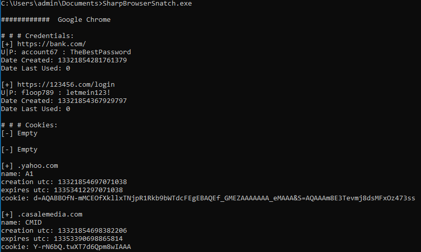

## BrowserSnatch
Gather credentials from Chrome based browsers on Windows
- built using .NET 6 but will run on the default .NET 4 



## Build
Install .NET 6
```
sudo apt install dotnet-sdk-6.0
```

Required Packages
```
dotnet add package System.Data.SQLite
dotnet add package System.Text.Json
```

Build
```
dotnet publish -r win-x64 -p:PublishSingleFile=true --self-contained true -p:PublishTrimmed=true
```

Files Created
```
SharpBrowserSnatch.exe
SQLite.Interop.dll
```

#### File Locations (Google example)
Key used to encrypt passwords/cookies
```
C:\Users\admin\AppData\Local\Google\Chrome\User Data\Local State
```

Encrypted login credentials
```
C:\Users\admin\AppData\Local\Google\Chrome\User Data\Default\Login Data
```

Encrypted cookies
```
C:\Users\admin\AppData\Local\Google\Chrome\User Data\Default\Network\Cookies
```
#### To Do
- [ ] Clean
- [ ] Remove dll
- [ ] Fix Format for Date/Time "Last Used"
- [ ] Firefox support

#### Resources that inspired the project
- [Unit 42: Credential Gathering From Third-Party Software](https://unit42.paloaltonetworks.com/credential-gathering-third-party-software/#post-124901-_uoyret6muycd)
    - [Example Code: Python Passwords](https://www.thepythoncode.com/article/extract-chrome-passwords-python)
    - [Example Code: Pyhton Cookies](https://www.thepythoncode.com/article/extract-chrome-cookies-python)


